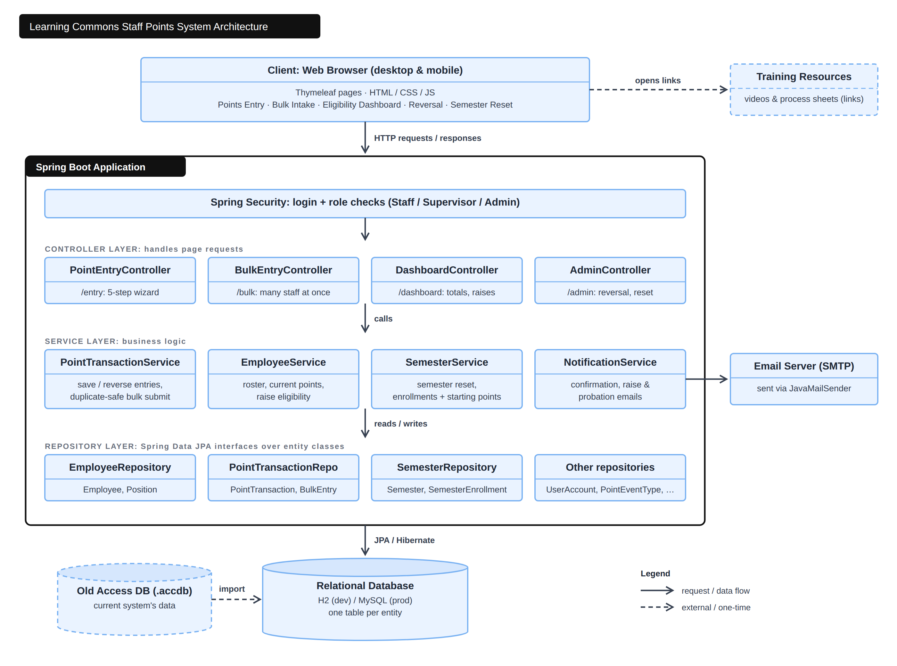

**1. Title and Group Members**
* Title: Learning Commons Cloud System
* Team Members: Han Nguyen, Saurav Poudel, Uyen Duong, Van Diep, Jaxon Zaleski    

**2. Project Overview**
* The Learning Commons Cloud System is an existing system used to manage student and employee point-related processes. We have been asked to revamp the system because it is outdated and has several limitations that can create unnecessary work for users and supervisors. For example, the current system does not always provide confirmation when a submission is completed. This can lead to duplicate emails being sent to both the supervisor and user, as well as users having to manually go back and subtract student points when a submission is processed incorrectly. The project will thus focus on modernizing the current system while preserving its core functionality. The proposed project will examine the existing system, identify areas for improvement, and establish requirements for a more reliable, efficient, and user-friendly system.

**3. Goals and Objectives**
* The primary goal of this project is to modernize the Learning Commons Cloud System while preserving its existing core functionality. The revamped system should reduce unnecessary work for students, employees, and supervisors while providing a more reliable and efficient experience. The project aims to:
	* Preserve existing data from the current system while transitioning to the modernized system.
 	* Improve the reliability and usability of the existing system.
	* Reduce unnecessary communication and manual work caused by system limitations.
	* Make entering and managing points more efficient.
 	* Improve communication between staff, supervisors, and employees.
  	* Simplify the process of managing the system at the beginning of each semester.
  	* Provide clear documentation and training resources for new users.

* To accomplish these goals, the project will:
	* Review and migrate the existing database data into the modernized system while maintaining data accuracy and accessibility.	 	
	* Develop a bulk intake form that allows staff to enter multiple point-related records efficiently.
	* Implement automated email notifications for relevant point-related actions.
	* Notify employees and appropriate supervisors when an employee reaches 125 or more points and becomes eligible for a raise.
	* Configure automated emails to notify the staff member entering the points, the supervisor of the position, and the employee receiving the points.
	* Allow infractions to be entered as positive numbers while correctly applying them as reductions to the employee's rolling point total.
	* Provide a method for reversing or correcting point entries when an error has been made.
	* Create a semester reset process that allows administrators to add and remove staff members and establish the appropriate starting point totals.
	* Set new employees to a starting balance of 65 points and returning employees to a starting balance of 70 points at the beginning of each semester.
	* Preserve necessary historical information when completing a semester reset.
	* Develop a training video to help new users learn how to use the system.
	* Create a process sheet that documents common system procedures and provides a reference for new and existing users.

**4. Functional Requirements**

* Bulk Intake Form
	* Given multiple new tutors need to be added to the system at the beginning of a semester...
	* When an administrator uploads a bulk intake file...
	* Then the system should create records for all valid tutor entries.

* Raise Eligibility Notification
	* Given a tutor has accumulated performance points...
	* When the tutor reaches 125 or more points...
	* Then the system should automatically notify relevant staff that the tutor is eligible for a raise.

* Supervisor Notifications
	* Given a point transaction is entered for a tutor...
	* When the transaction is submitted...
	* Then the system should send notifications to the employee, supervisor, and staff member who entered the points.

* Semester Reset
	* Given a new semester is starting...
	* When an administrator performs a semester reset...
	* Then tutor point totals should be reset according to established rules.

* Point Reversal
	* Given a point entry was entered incorrectly...
	* When an administrator chooses to reverse the transaction...
	* Then the tutor's point total should be adjusted accordingly.

* Positive Infraction Entry
	* Given an employee receives an infraction...
	* When a staff member enters the infraction value as a positive number...
	* Then the system should subtract the value from the tutor's rolling point total.

* Employee Setup During Semester Reset
	* Given the system is being prepared for a new semester...
	* When an administrator completes the semester reset process...
	* Then new tutors should receive 65 starting points and returning tutors should receive 70 starting points.

* Staff Maintenance
	* Given staff membership changes between semesters...
	* When an administrator adds or removes tutors from the system...
	* Then the database should accurately reflect the current roster of tutors.

* Automated Email Distribution
	* Given a point-related event requires notification...
	* When the system generates an automated email...
	* Then the email should be sent to all designated recipients based on the notification rules.

* Training Resources
	* Given a new user needs assistance learning the system...
	* When the user accesses training materials...
	* Then the user should be able to view process documentation and instructional resources for system usage.

**5. Storyboard (screen mockups):**

* The storyboard illustrates the primary workflows of the Learning Commons Staff Points System. The application includes a standard staff-points entry workflow and additional administrative workflows.

**Staff Points Entry Workflow**

Home → Who and What → Bonus/Infraction Details → Points and Date → Review → Confirmation

The user begins by selecting a staff member and choosing whether to record a bonus or infraction. The user then selects the event type, reviews the point value and date, adds any required details or attachments, and reviews the entry before submitting. The system displays a confirmation after the entry is successfully saved.

**Administrative Workflows**

- **Bulk Intake** : Apply the same event to multiple staff members.
- **Eligibility Dashboard** : View staff point totals and raise eligibility.
- **Point Reversal** : Reverse an incorrect point entry while preserving the history.
- **Semester Reset** : Manage the roster and reset staff points for a new semester.

**Screen Mockups**

[View Screen Mockups](./docs/UCLCMockups.pdf)

**6. Class Diagram**

* UML-based class diagram. 

* Class Diagram Description: One or two lines for each class to describe use of interfaces, classes and resources, interfaces, etc. Don't worry about putting more than a few words for each class; this does not need to be thorough. 
You need to submit both a document file and a link to this .md file on your GitHub repo.

**7. Architecture and components of your application (Diagram)**
* 

**8. Scrum roles and who will fill those roles (responsibilities of each member in the group)**
* Van Diep
	* Role: Scrum Master
 	* Responsibilities: Leads Scrum meetings, coordinates Sprint planning, removes blockers.	
* Saurav Poudel
	* Role: Developer
 	* Responsibilities: Backend and front-end development
* Han Nguyen
 	* Role: Developer
 	* Responsibilities: Front-end developer, and help with back-end coding	
* Uyen Duong
 	* Role: Developer
 	* Responsibilities:	Back-end developer, and help with front-end if needed
* Jaxon Zaleski
 	* Role: Developer
 	* Responsibilities: Back-end and front-end if needed
  
**9. GitHub project [link.](https://github.com/hnngxn/Learning-Commons-App-Dev/projects)** 

**10. Each team must submit their GitHub repository and [GitHub Project board](https://github.com/hnngxn/Learning-Commons-App-Dev/projects). This will be used to track milestones, stories, and sprint tasks for your final project.**

